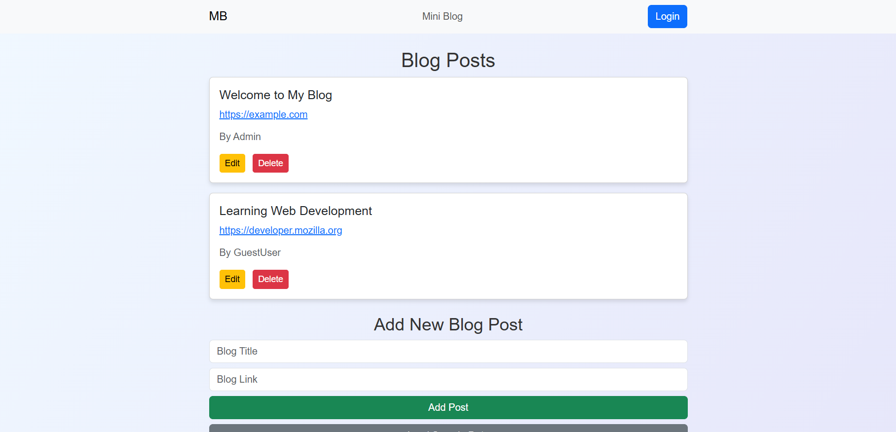

# Blog App 

## Authorship
- Griffin Shewbart
- [gshew24](https://github.com/gshew24)

## Attribution
- Bootstrap 5, Normalize.css, jQuery libraries were used for frontend styling and functionality.
- Project guided with assistance from ChatGPT walkthroughs.

## User Story
> As a user interested in blogging resources,  
> I want to be able to view, add, edit, and delete blog entries,  
> So that I can keep track of blogs easily in one place.

## Narrative
This app was developed as part of a coding course project. The goal was to revisit an early assignment and upgrade it using newly learned skills such as JSON file loading, DOM manipulation, jQuery, Bootstrap styling, and GitHub deployment.  
This application allows users to log in (dummy login), view blog posts, add new blog posts, edit titles, and delete posts, all with a responsive, polished frontend.

## Screenshots
- App homepage:
  
- Edit/Delete functionality example:
  

## Validation Links
- [HTML Validation Results](https://validator.w3.org/nu/?doc=https%3A%2F%2Fgshew24.github.io%2Fblog-app%2F)
- [Accessibility Evaluation Results](https://wave.webaim.org/report#/https://gshew24.github.io/blog-app/)
- [Wireframe Page](https://gshew24.github.io/blog-app/pages/wireframe.html)


## Future App Ideas
- Add persistent data saving using LocalStorage or a real database.
- Create user accounts with login authentication.
- Allow users to upload blog post images.
- Improve mobile responsiveness with a mobile-first layout.
- Add categories/tags for different types of blog posts.
- Build a full CRUD (Create, Read, Update, Delete) API backend to save posts.

## Code Snippet Highlight
```javascript
$(document).on('click', '.edit-btn', function() {
  const index = $(this).data('index');
  const newTitle = prompt('Edit the blog title:', blogEntries[index].title);
  if (newTitle) {
    blogEntries[index].title = newTitle;
    renderBlogs();
  }
});
